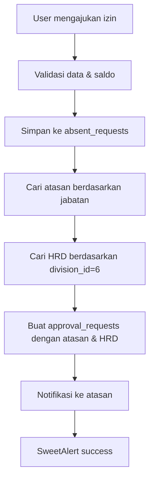
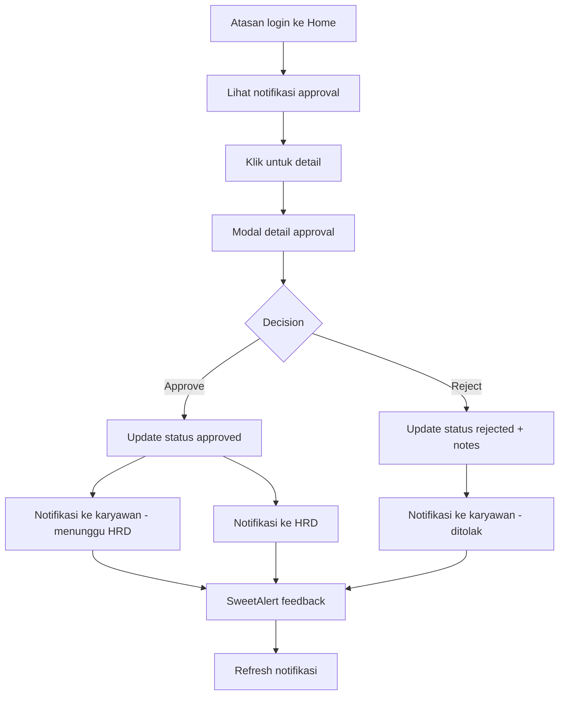
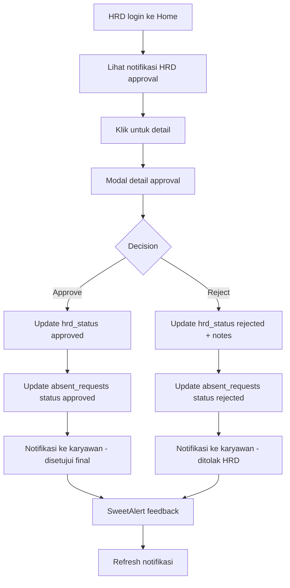

# Sistem Approval Izin/Cuti
## Dokumentasi Lengkap

---

## 📋 **Daftar Isi**
1. [Overview](#overview)
2. [Database Schema](#database-schema)
3. [Backend Components](#backend-components)
4. [Frontend Components](#frontend-components)
5. [API Endpoints](#api-endpoints)
6. [Workflow](#workflow)
7. [Setup Instructions](#setup-instructions)

---

## 🎯 **Overview**

Sistem approval izin/cuti memungkinkan karyawan mengajukan izin/cuti yang kemudian akan dikirim ke atasan untuk disetujui atau ditolak. Setelah atasan menyetujui, permohonan akan dikirim ke HRD untuk approval final. Sistem ini terintegrasi dengan halaman Home untuk notifikasi real-time.

### **Fitur Utama:**
- ✅ Pengajuan izin/cuti dengan dokumen pendukung
- ✅ **Two-level approval system**: Atasan → HRD
- ✅ **Audit trail lengkap**: Approved by, approved at, rejected by, rejected at
- ✅ Notifikasi otomatis ke atasan via tabel `notifications`
- ✅ Notifikasi otomatis ke HRD setelah atasan approve
- ✅ Approval/rejection dengan catatan
- ✅ Notifikasi real-time di Home page (approval requests + HRD approvals + notifications)
- ✅ Modal detail approval yang interaktif dengan tombol berbeda untuk atasan/HRD
- ✅ **Informasi approval lengkap** di modal detail (siapa yang approve, kapan, catatan)
- ✅ SweetAlert untuk feedback user
- ✅ Notifikasi ke karyawan saat izin disetujui/ditolak

---

## 🗄️ **Database Schema**

### **Tabel: `approval_requests`**
```sql
CREATE TABLE `approval_requests` (
  `id` bigint(20) unsigned NOT NULL AUTO_INCREMENT,
  `user_id` bigint(20) unsigned NOT NULL COMMENT 'User yang mengajukan izin',
  `approver_id` bigint(20) unsigned NOT NULL COMMENT 'User yang harus approve (atasan)',
  `hrd_approver_id` bigint(20) unsigned NULL DEFAULT NULL COMMENT 'HRD yang harus approve',
  `leave_type_id` bigint(20) unsigned NOT NULL COMMENT 'Jenis izin/cuti',
  `date_from` date NOT NULL COMMENT 'Tanggal mulai izin',
  `date_to` date NOT NULL COMMENT 'Tanggal selesai izin',
  `reason` text NOT NULL COMMENT 'Alasan izin',
  `document_path` varchar(255) NULL DEFAULT NULL COMMENT 'Path dokumen pendukung',
  `status` enum('pending','approved','rejected') NOT NULL DEFAULT 'pending',
  `hrd_status` enum('pending','approved','rejected') NULL DEFAULT NULL,
  `approved_at` timestamp NULL DEFAULT NULL,
  `rejected_at` timestamp NULL DEFAULT NULL,
  `hrd_approved_at` timestamp NULL DEFAULT NULL,
  `hrd_rejected_at` timestamp NULL DEFAULT NULL,
  `approval_notes` text NULL DEFAULT NULL COMMENT 'Catatan dari approver',
  `hrd_approval_notes` text NULL DEFAULT NULL COMMENT 'Catatan dari HRD',
  `created_at` timestamp NULL DEFAULT NULL,
  `updated_at` timestamp NULL DEFAULT NULL,
  PRIMARY KEY (`id`),
  KEY `approval_requests_user_id_foreign` (`user_id`),
  KEY `approval_requests_approver_id_foreign` (`approver_id`),
  KEY `approval_requests_hrd_approver_id_foreign` (`hrd_approver_id`),
  KEY `approval_requests_leave_type_id_foreign` (`leave_type_id`),
  KEY `approval_requests_status_index` (`status`),
  KEY `approval_requests_created_at_index` (`created_at`),
  CONSTRAINT `approval_requests_user_id_foreign` FOREIGN KEY (`user_id`) REFERENCES `users` (`id`) ON DELETE CASCADE,
  CONSTRAINT `approval_requests_approver_id_foreign` FOREIGN KEY (`approver_id`) REFERENCES `users` (`id`) ON DELETE CASCADE,
  CONSTRAINT `approval_requests_hrd_approver_id_foreign` FOREIGN KEY (`hrd_approver_id`) REFERENCES `users` (`id`) ON DELETE CASCADE,
  CONSTRAINT `approval_requests_leave_type_id_foreign` FOREIGN KEY (`leave_type_id`) REFERENCES `leave_types` (`id`) ON DELETE CASCADE
) ENGINE=InnoDB DEFAULT CHARSET=utf8mb4 COLLATE=utf8mb4_unicode_ci;
```

---

## 🔧 **Backend Components**

### **1. Model: `ApprovalRequest`**
**File:** `app/Models/ApprovalRequest.php`

**Fitur:**
- Relasi dengan User, LeaveType
- Scopes untuk filtering (pending, approved, rejected)
- Accessors untuk status text dan color
- Methods untuk approve/reject

**Relasi:**
```php
public function user() // User yang mengajukan
public function approver() // User yang approve
public function leaveType() // Jenis izin/cuti
```

### **2. Controller: `ApprovalController`**
**File:** `app/Http/Controllers/ApprovalController.php`

**Methods:**
- `getPendingApprovals()` - Ambil approval yang pending
- `getApprovalDetails($id)` - Detail approval request
- `approve($id)` - Setujui permohonan
- `reject($id)` - Tolak permohonan
- `getApprovalStats()` - Statistik approval
- `getMyRequests()` - Request yang diajukan user

### **3. Updated: `AttendanceController`**
**File:** `app/Http/Controllers/AttendanceController.php`

**Perubahan:**
- Method `submitAbsentRequest()` diupdate untuk membuat approval request
- Method `findApprover()` untuk mencari atasan berdasarkan jabatan hierarchy

**Logic Mencari Atasan:**
```php
private function findApprover($user)
{
    // 1. Ambil jabatan user
    $userJabatan = DB::table('tbl_data_jabatan')
        ->where('id_jabatan', $user->id_jabatan)
        ->first();
    
    // 2. Cari user dengan id_atasan jabatan di outlet yang sama
    $approver = DB::table('users as u')
        ->join('tbl_data_jabatan as j', 'u.id_jabatan', '=', 'j.id_jabatan')
        ->where('j.id_jabatan', $userJabatan->id_atasan)
        ->where('u.id_outlet', $user->id_outlet)
        ->where('u.status', 'A')
        ->first();
    
    return $approver;
}
```

### **4. Updated: `User` Model**
**File:** `app/Models/User.php`

**Relasi Baru:**
```php
public function approvalRequests() // Request yang diajukan
public function pendingApprovals() // Approval yang pending
public function approvedRequests() // Request yang disetujui
public function rejectedRequests() // Request yang ditolak
```

### **5. Updated: `HandleInertiaRequests` Middleware**
**File:** `app/Http/Middleware/HandleInertiaRequests.php`

**Perubahan:**
- Menambahkan `pending_approvals_count` ke data user yang dibagikan
- Memuat relasi jabatan.level untuk informasi level

### **6. Notifikasi System**
**Tabel:** `notifications`

**Jenis Notifikasi:**
- `leave_approval_request` - Notifikasi ke atasan saat ada permohonan izin
- `leave_supervisor_approved` - Notifikasi ke karyawan saat atasan menyetujui (menunggu HRD)
- `leave_hrd_approval_request` - Notifikasi ke HRD saat atasan sudah approve
- `leave_approved` - Notifikasi ke karyawan saat izin disetujui sepenuhnya
- `leave_rejected` - Notifikasi ke karyawan saat izin ditolak

**Struktur Notifikasi:**
```php
DB::table('notifications')->insert([
    'user_id' => $userId,
    'type' => 'leave_approval_request',
    'message' => "Permohonan izin/cuti baru dari {$user->nama_lengkap}...",
    'url' => config('app.url') . '/home',
    'is_read' => 0,
    'created_at' => now(),
    'updated_at' => now()
]);
```

### **7. Audit Trail System**
**Informasi yang Tersimpan:**

**Untuk Atasan:**
- `approver_id` - ID user yang approve/reject
- `approved_at` - Timestamp saat approve
- `rejected_at` - Timestamp saat reject
- `approval_notes` - Catatan dari atasan

**Untuk HRD:**
- `hrd_approver_id` - ID HRD yang approve/reject
- `hrd_approved_at` - Timestamp saat HRD approve
- `hrd_rejected_at` - Timestamp saat HRD reject
- `hrd_approval_notes` - Catatan dari HRD

**Accessors di Model:**
```php
// Mendapatkan nama yang approve
$approval->approved_by // Nama atasan yang approve
$approval->hrd_approved_by // Nama HRD yang approve

// Mendapatkan timestamp
$approval->approved_at // Waktu atasan approve
$approval->hrd_approved_at // Waktu HRD approve
```

---

## 🎨 **Frontend Components**

### **1. Updated: `Home.vue`**
**File:** `resources/js/Pages/Home.vue`

**Fitur Baru:**
- **Notification Section** - Menampilkan approval yang pending
- **Approval Modal** - Modal detail untuk approve/reject
- **Real-time Updates** - Auto refresh setelah action

**State Management:**
```javascript
const pendingApprovals = ref([]);
const loadingApprovals = ref(false);
const showApprovalModal = ref(false);
const selectedApproval = ref(null);
```

**Functions:**
```javascript
loadPendingApprovals() // Load data approval
showApprovalDetails(id) // Show modal detail
approveRequest(id) // Approve dengan SweetAlert
rejectRequest(id) // Reject dengan input notes
```

### **2. Updated: `Attendance/Index.vue`**
**File:** `resources/js/Pages/Attendance/Index.vue`

**Perubahan:**
- Mengganti semua `alert()` dengan SweetAlert2
- Notifikasi yang lebih modern dan user-friendly

---

## 🌐 **API Endpoints**

### **Approval Routes**
```php
// Approval Routes
Route::middleware(['auth', 'verified'])->prefix('api/approval')->group(function () {
    Route::get('/pending', [ApprovalController::class, 'getPendingApprovals']);
    Route::get('/pending-hrd', [ApprovalController::class, 'getPendingHrdApprovals']);
    Route::get('/stats', [ApprovalController::class, 'getApprovalStats']);
    Route::get('/my-requests', [ApprovalController::class, 'getMyRequests']);
    Route::get('/notifications', [ApprovalController::class, 'getLeaveNotifications']);
    Route::get('/{id}', [ApprovalController::class, 'getApprovalDetails']);
    Route::post('/{id}/approve', [ApprovalController::class, 'approve']);
    Route::post('/{id}/reject', [ApprovalController::class, 'reject']);
    Route::post('/{id}/hrd-approve', [ApprovalController::class, 'hrdApprove']);
    Route::post('/{id}/hrd-reject', [ApprovalController::class, 'hrdReject']);
});
```

### **API Responses**

**GET `/api/approval/pending`**
```json
{
    "success": true,
    "approvals": [
        {
            "id": 1,
            "user": {
                "id": 123,
                "nama_lengkap": "John Doe",
                "jabatan": {
                    "nama_jabatan": "Staff"
                }
            },
            "leave_type": {
                "name": "Annual Leave"
            },
            "date_from": "2024-01-15",
            "date_to": "2024-01-17",
            "reason": "Family vacation",
            "duration_text": "3 hari",
            "status": "pending"
        }
    ]
}
```

**POST `/api/approval/{id}/approve`**
```json
{
    "success": true,
    "message": "Permohonan izin/cuti berhasil disetujui"
}
```

**POST `/api/approval/{id}/reject`**
```json
{
    "success": true,
    "message": "Permohonan izin/cuti berhasil ditolak"
}
```

**GET `/api/approval/notifications`**
```json
{
    "success": true,
    "notifications": [
        {
            "id": 1,
            "user_id": 123,
            "type": "leave_approved",
            "message": "Permohonan izin/cuti Anda (Annual Leave) untuk periode 2024-01-15 - 2024-01-17 telah disetujui oleh John Doe.",
            "url": "http://localhost:8000/attendance",
            "is_read": 0,
            "created_at": "2024-01-15T10:30:00.000000Z",
            "updated_at": "2024-01-15T10:30:00.000000Z"
        }
    ]
}
```

---

## 🔄 **Workflow**

### **1. Pengajuan Izin/Cuti**


### **2. Proses Approval Atasan**


### **3. Proses Approval HRD**


---

## 🚀 **Setup Instructions**

### **1. Database Setup**
```bash
# Jalankan SQL untuk membuat tabel
mysql -u username -p database_name < create_approval_requests_table.sql
```

### **2. File Setup**
Pastikan file-file berikut sudah dibuat:
- ✅ `app/Models/ApprovalRequest.php`
- ✅ `app/Http/Controllers/ApprovalController.php`
- ✅ `create_approval_requests_table.sql`

### **3. Routes Setup**
Routes sudah ditambahkan di `routes/web.php`

### **4. Frontend Setup**
- ✅ SweetAlert2 sudah terinstall
- ✅ Home.vue sudah diupdate
- ✅ Attendance/Index.vue sudah diupdate

### **5. Testing**
```bash
# Test API endpoints
curl -X GET "http://localhost:8000/api/approval/pending" \
  -H "Authorization: Bearer YOUR_TOKEN"

# Test approval
curl -X POST "http://localhost:8000/api/approval/1/approve" \
  -H "Authorization: Bearer YOUR_TOKEN"
```

---

## 📱 **User Experience**

### **Untuk Karyawan:**
1. **Pengajuan** - Form izin dengan validasi saldo
2. **Feedback** - SweetAlert konfirmasi berhasil
3. **Tracking** - Bisa lihat status permohonan

### **Untuk Atasan:**
1. **Notifikasi** - Badge merah di Home page
2. **Detail** - Modal dengan informasi lengkap
3. **Action** - Tombol approve/reject dengan SweetAlert
4. **Feedback** - Konfirmasi action berhasil

---

## 🔧 **Configuration**

### **Environment Variables**
Tidak ada environment variable khusus yang diperlukan.

### **File Permissions**
Pastikan folder `storage/app/public/absent-documents` bisa ditulis:
```bash
chmod 755 storage/app/public/absent-documents
```

### **Cron Jobs**
Tidak ada cron job khusus untuk sistem approval.

---

## 🐛 **Troubleshooting**

### **Common Issues:**

1. **Approval tidak muncul di Home**
   - Cek apakah user memiliki atasan (id_atasan di tbl_data_jabatan)
   - Cek apakah atasan ada di outlet yang sama
   - Cek status user atasan (harus 'A')

2. **Modal tidak muncul**
   - Cek console browser untuk error JavaScript
   - Pastikan SweetAlert2 terinstall

3. **API error 404**
   - Pastikan routes sudah terdaftar
   - Cek middleware auth

4. **File upload gagal**
   - Cek permission folder storage
   - Cek ukuran file (max 5MB)

---

## 📈 **Future Enhancements**

### **Potential Improvements:**
- [ ] Email notifications untuk approval
- [ ] Push notifications mobile
- [ ] Multi-level approval hierarchy
- [ ] Approval delegation
- [ ] Approval history & analytics
- [ ] Bulk approval actions
- [ ] Approval templates
- [ ] Integration dengan calendar

---

**Sistem approval izin/cuti sudah siap digunakan!** 🎉
