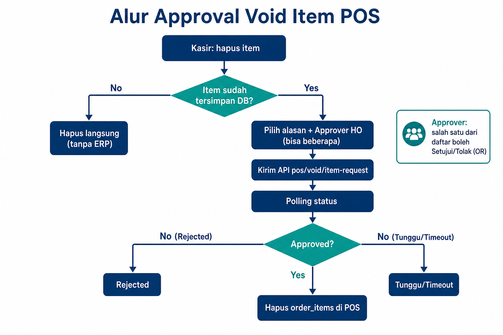
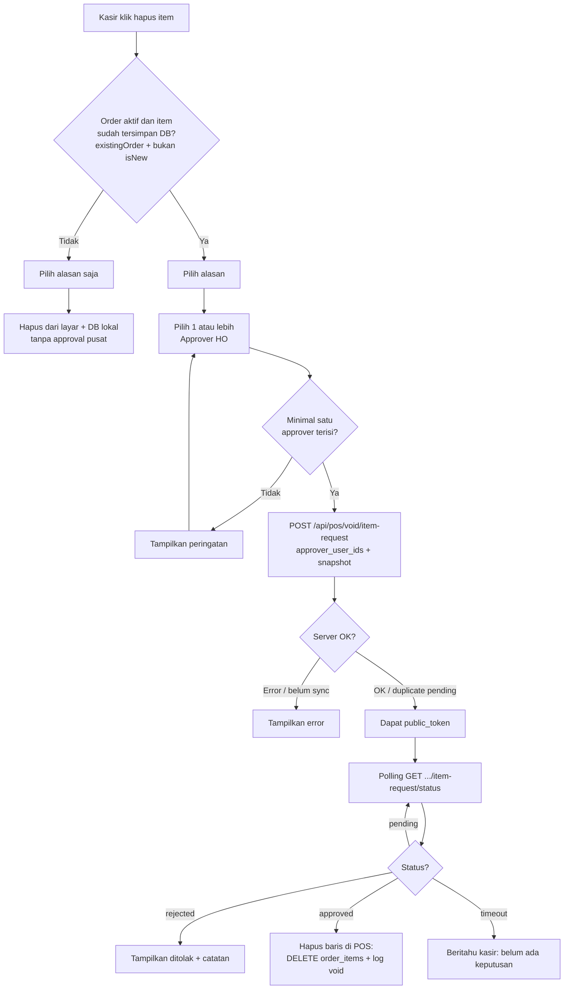
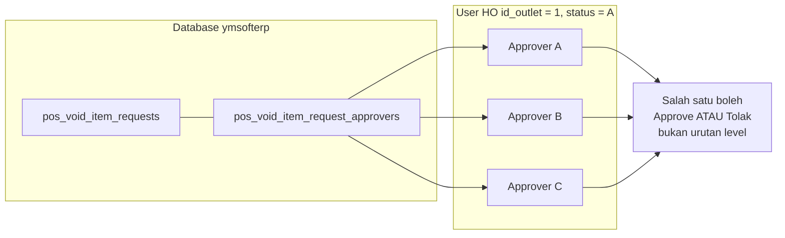
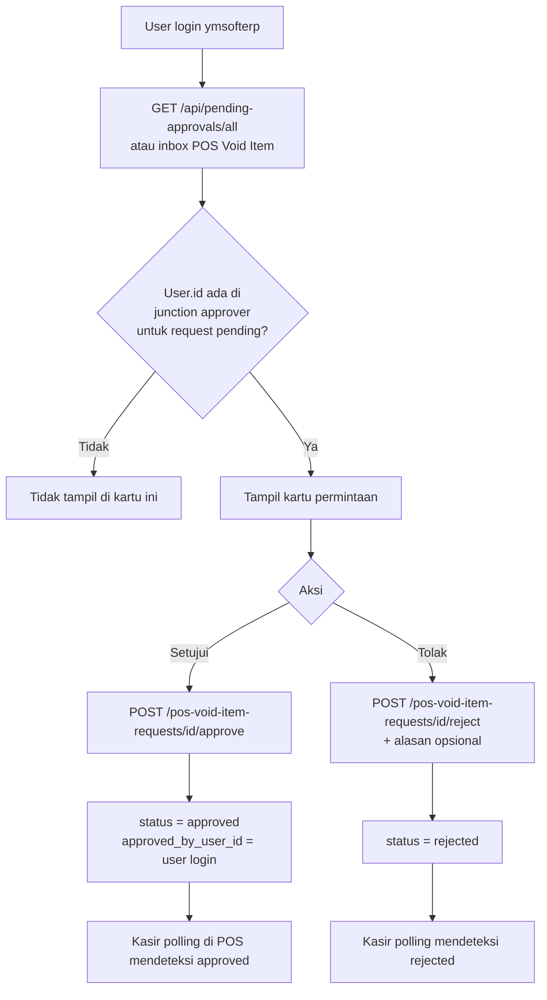
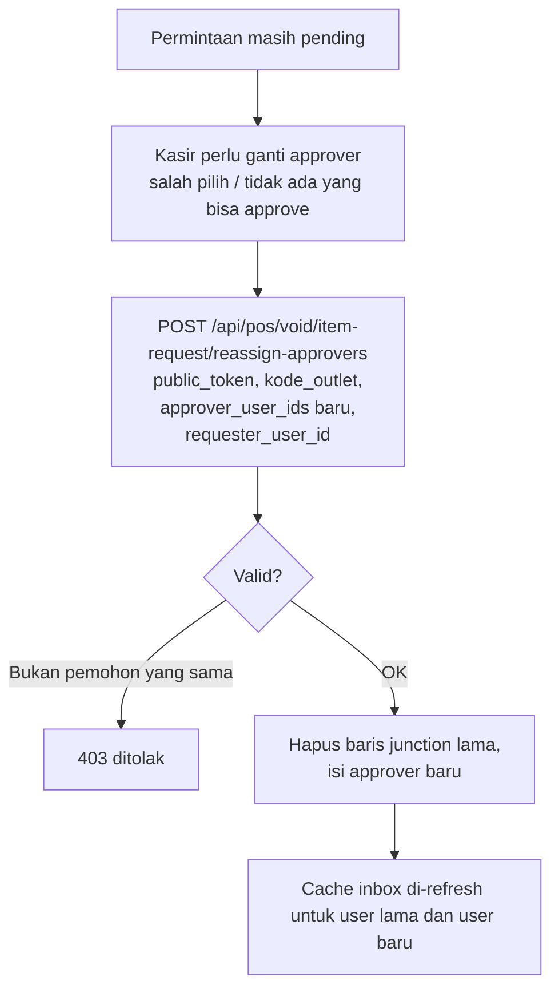

# Flowchart — Approval Void Item (POS → ymsofterp)

Dokumen ini menjelaskan alur **void item** di Order Screen ketika baris sudah tersimpan di database: multi-approver (OR), polling, dan opsi ganti approver.

## Gambar ringkas (PNG)

Banyak preview Markdown **tidak merender** diagram Mermaid di bawah; kalau yang tampil hanya blok kode, buka file PNG ini (bisa disisipkan di presentasi / WA / Word):

*File: `docs/pos_void_item_approval_flowchart.png` (satu folder dengan file ini).*

---

## 1. Alur utama (kasir — Order Screen)

---

## 2. Siapa yang boleh approve / tolak (ERP — Home / session)

---

## 3. Alur approver di Home (setelah login)

---

## 4. Ganti daftar approver (masih pending)

Hanya untuk permintaan **pending**. Kasir yang sama (`requester_user_id` cocok dengan yang tercatat, jika ada).

---

## 5. Ringkasan aktor

| Aktor | Peran |
|--------|--------|
| Kasir POS | Hapus item, kirim request, polling, eksekusi hapus DB lokal setelah **approved** |
| Approver HO | Satu dari banyak yang dipilih kasir; siapa saja di daftar boleh approve/tolak |
| Database pusat | Menyimpan request + junction approver; sumber kebenaran status |

---

*File terkait SQL: `database/sql/pos_void_item_requests.sql`*  
*Controller: `App\Http\Controllers\PosVoidItemRequestController`*
